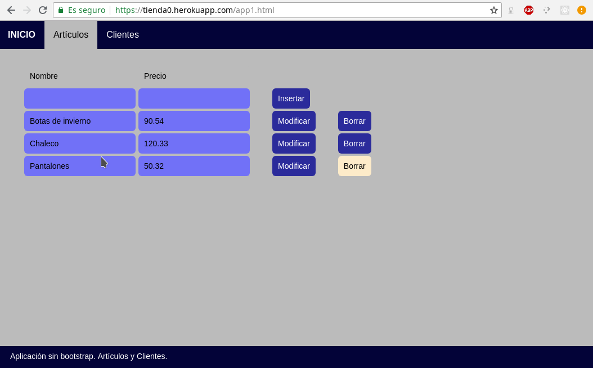
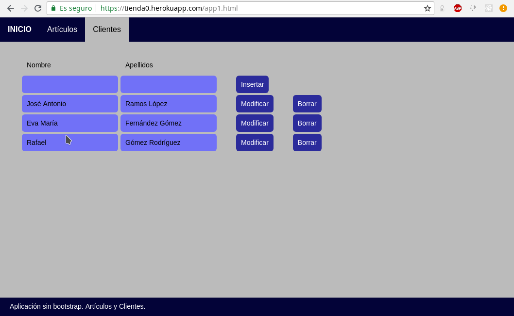
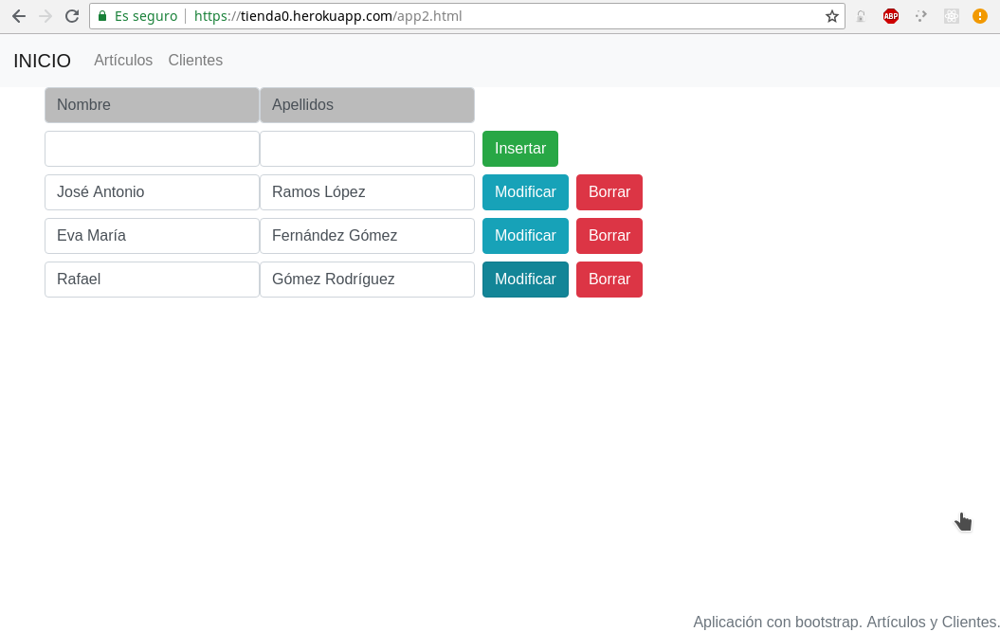

# tienda0
# Proyecto Fullstack con NODEJS + EXPRESS + MONGODB

[](http://vanilla-js.com/)


## Introducción

Este es un proyecto realizado con fines educativos. 

Se utilizan los mínimos recursos (ya sean estos paquetes, librerías o frameworks). Tambien se intenta minimizar el número de archivos utilizados. Este proyecto **NO** necesita de frameworks como Angular, React o Vue para el FrondEnd, ya que hacemos uso de [VanillaJS](http://vanilla-js.com/) ( **~~MEAN~~**, **~~MERN~~**, **~~MEVN~~**  ). 

Existen 3 aplicaciones web dentro de proyecto, denominadas App0, App1 y App2. Cada una de ellas es una SPA (Single Page Application).








Los archivos utilizados son los siguientes:


```
├── config.js
├── index.js
├── models.js
├── package.for.react.json
├── package.json
├── package-lock.json
├── public
│   ├── app0.html
│   ├── app1.html
│   ├── app2.html
│   ├── css
│   │   ├── bootstrap.min.css
│   │   └── toastr.css
│   ├── favicon.png
│   ├── index.html
│   └── js
│       ├── bootstrap.min.js
│       ├── jquery-1.9.1.min.js
│       ├── jquery-migrate-1.2.1.min.js
│       └── toastr.js
├── README.md
└── routes.js
```


Para el BackEnd los archivos necesarios son:

- package.json
- index.js
- config.js
- models.js
- routes.js

Para el FrontEnd los archivos necesarios, según la App, son:

- App0
  - public/favicon.png
  - public/app0.html
  
- App1
  - public/favicon.png
  - public/app1.html
  
- App2
  - public/favicon.png
  - public/app2.html
  - public/css/*
  - public/js/*
  
La página `public/index.html` da acceso a las 3 applicaciones.


## Despliegue en local

Para poder ejecutar este proyecto en tu equipo local, sigue los siguientes pasos: 

1. Instala el servidor MongoDB. [Consulta la página oficial](https://docs.mongodb.com/manual/installation/).
2. Clona este repositorio en tu equipo:
  ```bash
  git  clone  https://github.com/jamj2000/tienda0.git
  cd   tienda0
  ```
3. Instala los módulos necesarios;
  ```bash
  npm  install
  ```
4. Inicia la aplicación
  ```bash
  npm  start
  ```
5. Abre en el navegador web la URL `http://localhost:3000`.
  

## Despliegue en Docker

Si deseas mantener limpio tu equipo y no tener que instalar Nodejs ni MongoDB, entonces puedes utilizar Docker.

Para ello, sigue los siguientes pasos:

1. Clona este repositorio en tu equipo:
  ```bash
  git  clone  https://github.com/jamj2000/tienda0.git
  cd   tienda0
  ```
  
2. Instala el software para Docker. En Ubuntu:

  ```bash
  sudo apt install docker.io
  sudo adduser <nombre_usuario>  docker
  ```
  Cerrar sesión y volver a iniciar sesión

3. Dentro de la carpeta que contiene el código, ejecuta: 

  ```bash
  docker-compose  up  -d
  ```

> NOTA: Los puertos 80 y 27017 no deben estar ocupados por ningún servicio previo. Son necesarios para los servicios de Node y Mongo que lanzará Docker.


