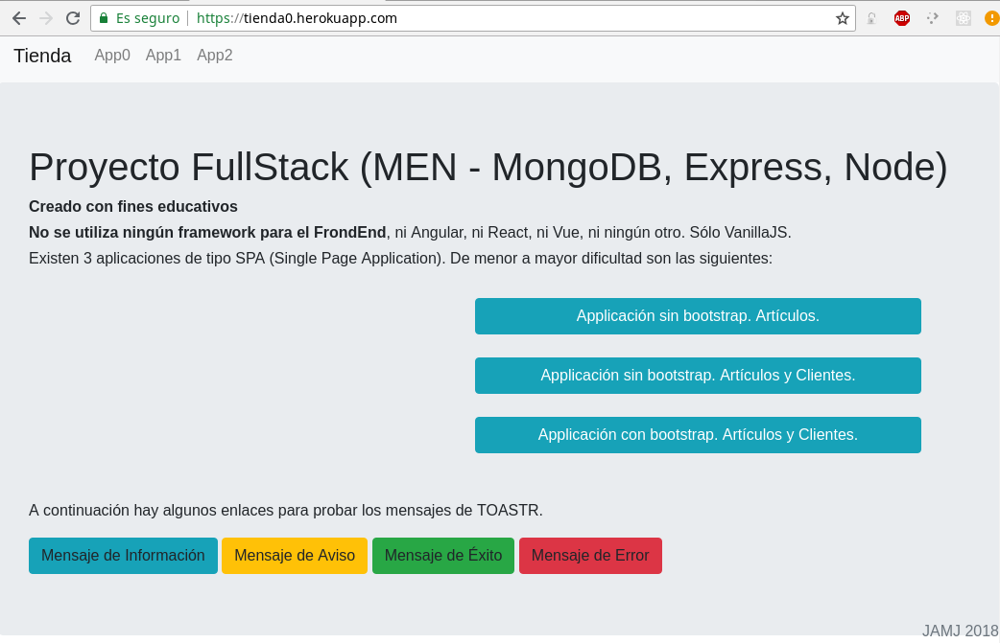
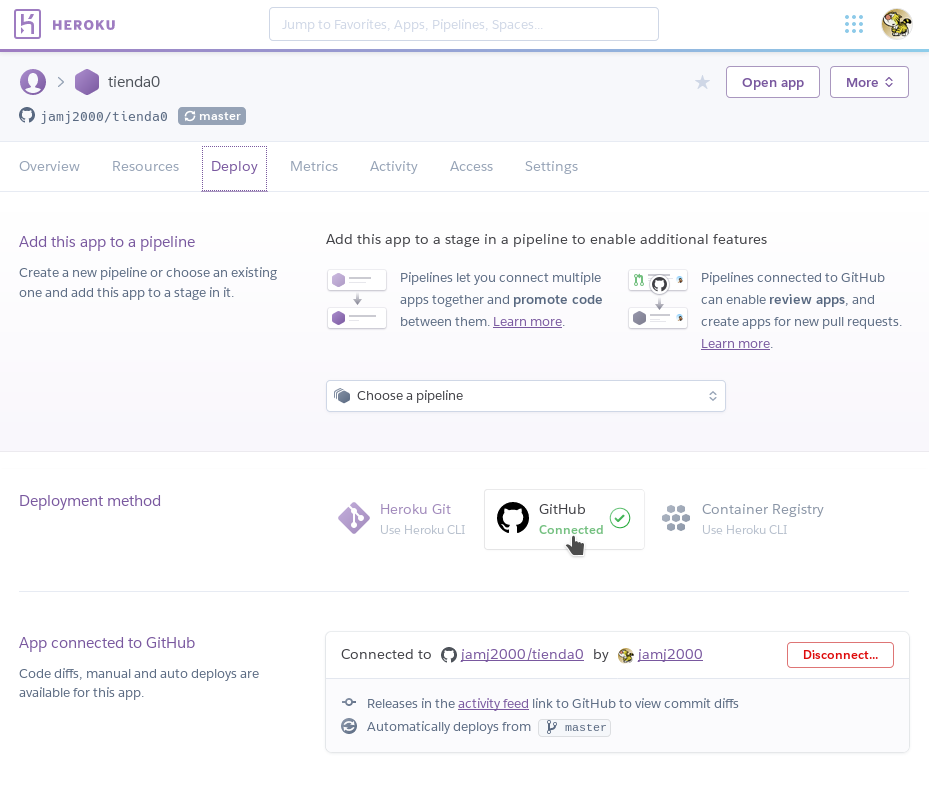
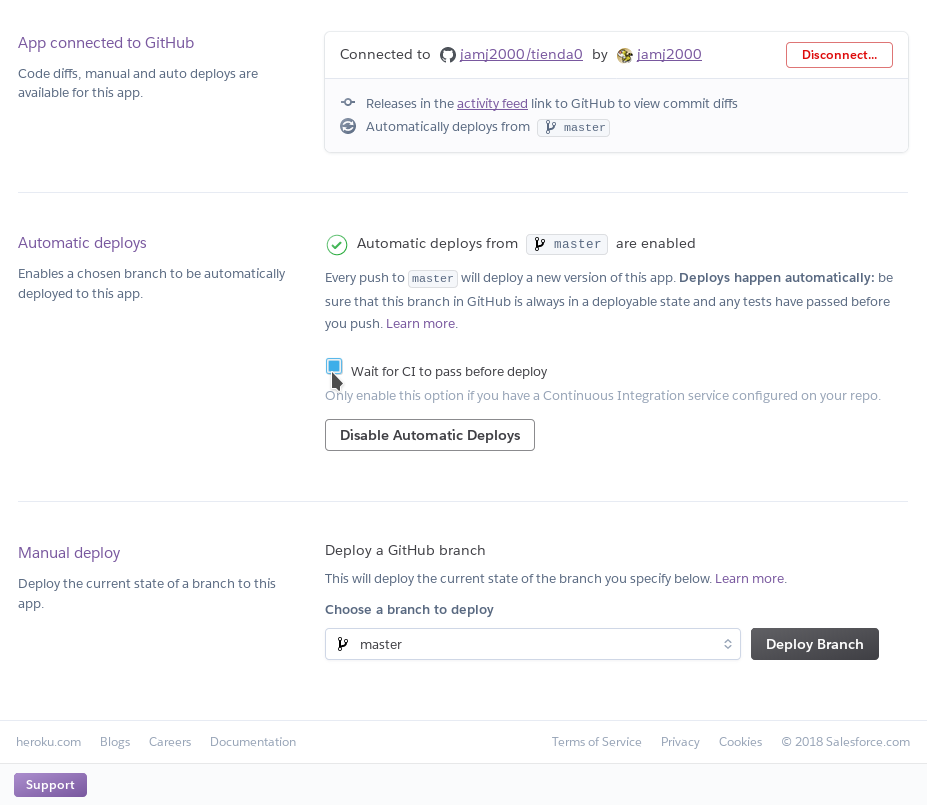
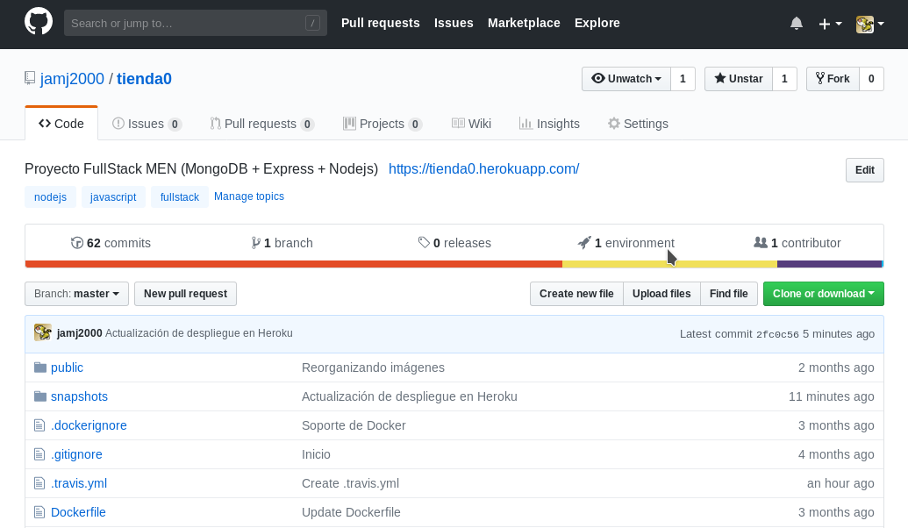
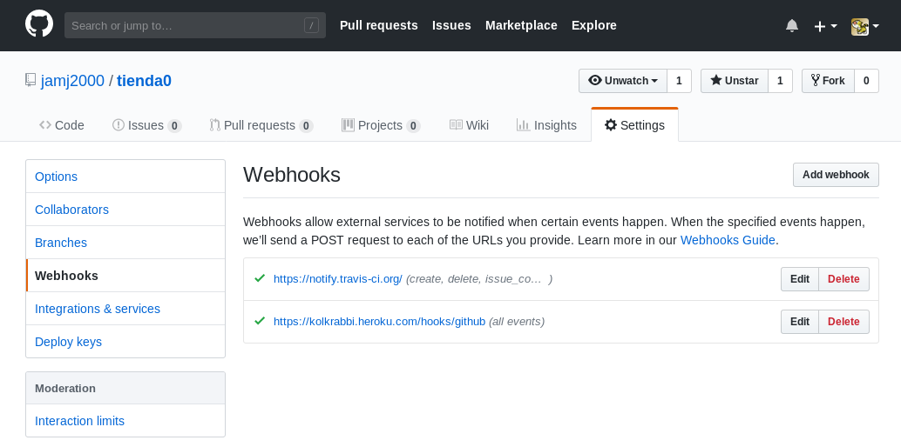

# tienda0
# Proyecto Fullstack con NODEJS + EXPRESS + MONGODB

[](https://travis-ci.org/jamj2000/tienda0)

[](http://vanilla-js.com/)


## Introducción

Este es un proyecto realizado con fines educativos. Actualmente está desplegado en [Heroku](https://tienda0.herokuapp.com/).

**BONUS:** La aplicación está desarrollada además como PWA (Progressive Web App). Esto quiere decir que si la abres con Android y pulsas en la opción "Añadir a pantalla de inicio", se te instalará dicha aplicación en tu móvil como si tratará de una aplicación nativa. 

Se utilizan los mínimos recursos (ya sean paquetes, librerías o frameworks). Tambien se intenta minimizar el número de archivos utilizados. Este proyecto **NO** necesita de frameworks como Angular, React o Vue para el FrondEnd, ya que hacemos uso de [VanillaJS](http://vanilla-js.com/) ( **~~MEAN~~**, **~~MERN~~**, **~~MEVN~~**  ). 

Existen 3 aplicaciones web dentro de proyecto, denominadas App0, App1 y App2. Cada una de ellas es una SPA (Single Page Application).




Los archivos utilizados son los siguientes:


```
├── config.js
├── index.js
├── models.js
├── package.for.react.json
├── package.json
├── package-lock.json
├── public
│   ├── app0.html
│   ├── app1.html
│   ├── app2.html
│   ├── css
│   │   ├── bootstrap.min.css
│   │   └── toastr.css
│   ├── favicon.png
│   ├── index.html
│   └── js
│       ├── bootstrap.min.js
│       ├── jquery-1.9.1.min.js
│       ├── jquery-migrate-1.2.1.min.js
│       └── toastr.js
├── README.md
└── routes.js
```


Para el BackEnd los archivos necesarios son:

- package.json
- index.js
- config.js
- models.js
- routes.js

Para el FrontEnd los archivos necesarios, según la App, son:

- App0
  - public/favicon.png
  - public/app0.html
  
- App1
  - public/favicon.png
  - public/app1.html
  
- App2
  - public/favicon.png
  - public/app2.html
  - public/css/*
  - public/js/*
  
La página `public/index.html` da acceso a las 3 applicaciones.


## Despliegue en local

Para poder ejecutar este proyecto en tu equipo local, sigue los siguientes pasos: 

1. Instala el servidor MongoDB. [Consulta la página oficial](https://docs.mongodb.com/manual/installation/).
2. Clona este repositorio en tu equipo:
  ```bash
  git  clone  https://github.com/jamj2000/tienda0.git
  cd   tienda0
  ```
3. Instala los módulos necesarios;
  ```bash
  npm  install
  ```
4. Inicia la aplicación
  ```bash
  npm  start
  ```
5. Abre en el navegador web la URL `http://localhost:3000`.
  

## Despliegue en Docker

Si deseas mantener limpio tu equipo y no tener que instalar Nodejs ni MongoDB, entonces puedes utilizar Docker.

Para ello, sigue los siguientes pasos:
  
1. Instala el software para Docker. En Ubuntu:

  ```bash
  sudo  apt  install  docker.io  docker-compose
  sudo  adduser  `id -un`  docker
  ```
  Cierra sesión y vuelve a iniciarla para cargar la nueva configuración de usuario ya añadido al grupo docker.


2. Clona este repositorio en tu equipo:
  ```bash
  git  clone  https://github.com/jamj2000/tienda0.git  &&   cd   tienda0
  ```

3. Dentro de la carpeta que contiene el código, ejecuta: 

  ```bash
  docker-compose  up  -d
  ```

> **NOTA:** Los puertos 80 y 27017 no deben estar ocupados por ningún servicio previo. Son necesarios para los servicios de Node y Mongo que lanzará Docker.


## Despliegue en Heroku + mLab

Actualmente la aplicación está desplegada en [HEROKU](https://www.heroku.com). Como base de datos utiliza DBaaS MongoDB proporcionado por [MLAB](https://mlab.com).

Si deseas hacer un despligue usando los servicios proporcionados por los sitios anteriores, sigue estos pasos: 

1. Create una cuenta en Heroku. Éste tiene varios [planes](https://www.heroku.com/pricing). Registrate en el plan Free, que aunque está algo limitado es gratis. Aún así se te solicitará un número de tarjeta. Tenlo en cuenta.


2. Instala la herramienta `heroku-cli`. En [este enlace](https://devcenter.heroku.com/articles/heroku-cli) tienes la información necesaria.

3. Clona este repositorio en tu equipo:
  ```bash
  git  clone  https://github.com/jamj2000/tienda0.git
  cd   tienda0
  ```

4. Inicia sesión desde el terminal en la cuenta que previamente creaste en Heroku. Y crea una nueva aplicación. 
  
  ```bash
  heroku login
  heroku create --region eu  nombre_aplicacion
  ```
  
  **NOTA:** Debes sustituir `nombre_aplicacion` por el nombre que desees dar a tu aplicación. Ten en cuenta que no puede tener espacios en blanco ni tildes. Probablemente tengas que probar con varios nombres, pues muchos de ellos ya están ocupados. La opción `--region eu` es para que la aplicación se aloje en servidores de Europa. 
  
5. Despliega el código en Heroku.

  ```bash
  heroku  push  heroku  master
  ```

  Dentro de unos instantes podrás acceder a la aplicación en la url `http://nombre_aplicacion.herokuapp.com`. 
  
  **NOTA:** Debes sustituir `nombre_aplicacion` por el nombre de tu aplicación.
  
  Puedes verla abriendo dicha url en el navegador o ejecutando
  
  ```bash
  heroku  open
  ```
  
  **DESPLIEGUE ALTERNATIVO**

  Podemos hacer uso de nuestro repositorio de GitHub en lugar de utilizar el repositorio que nos proporciona Heroku.

  Para ello, entra en tu cuenta de Heroku y selecciona tu aplicación.

  Pulsa en el apartado **Deploy**. Luego en **Deployment method**, selecciona **GitHub** en lugar de Heroku Git. En el siguiente apartado deberás indicar el repositorio de GitHub donde tienes el código de la aplicación.  

  

  A continuación podemos optar por dos tipos de despliegue:

  - Automático
  - Manual

  El despliegue automático nos permite desentendernos del proceso. Cada vez que realicemos un *push* al repositorio de GitHub, se realizará el despliegue en Heroku. 

  El despliegue automático es menos fiable que el despliegue manual, puesto que podemos realizar un despliegue de código no funcional. Para solucionar esto, marcaremos la casilla **Wait for CI to pass before deploy**. 

  

  >**NOTA:** Marcar la casilla anterior sólo tiene sentido si utilizas un sistema de integración continua como [Travis CI](https://travis-ci.org). Puedes darte de alta en él con tu identidad de GitHub.
  >
  > Previamente deberás haber creado en tu repositorio de GitHub el siguiente archivo **.travis.yml**:
  >
  > ```yaml
  > language: node_js
  > node_js:
  >   - "8"
  > ```
  >
  > Una vez iniciada sesión en TravisCI, deberás añadir el repositorio de GitHub con el código de tu aplicación. Cada vez que realices un *push* al repositorio en GitHub, TravisCI procederá a realizar la construcción (build). El resultado de la operación se indica mediante una insignia o *badge*, en color verde si todo fue correcto y en color rojo si la construcción dio errores.
  >
  > Ahora podrás realizar un *push* o modificar algún archivo del repositorio GitHub y verás a TravisCI en acción. 
  >  
  >
  >
  > Si has realizado todos los pasos anteriores correctamente verás que en tu repositorio GitHub te aparece un nuevo apartado de **environment**.
  >
  >
  >
  > Además, en **Settings -> Webhooks** debes ver los *webhooks* a TravisCI y Heroku.
  >
  >

6. ¿Y los datos?
  
  Los datos de la aplicación se guardan en una base de datos. En este caso hemos usado el DBaaS que nos proporciona [mLab](https://mlab.com). 
  
    
7. Este sitio tiene varios [planes](https://mlab.com/plans/). Escoge el plan Free, que aunque está algo limitado es gratis. 

8. Crea una base de datos MongoDB y apunta los parámetros de configuración.
  
  En concreto deberás anotar 5 datos:
  - El nombre o IP de host donde se aloja la base de datos.
  - El puerto.
  - El nombre de la base de datos.
  - El nombre del usuario.
  - La contraseña de dicho usuario.
  
  

9. Vuelve a la web de Heroku, inicia sesión, selecciona tu aplicación y pincha en el apartado `Settings` y luego en el botón `Reveal Config Vars`. Crea las variables de entorno que se muestran a continuación con los datos que recopilaste en el apartado anterior.

  
  

10. En la parte superior derecha de la página, pulsa en el boton `More` y luego en `Restart all dynos`.

  
  


